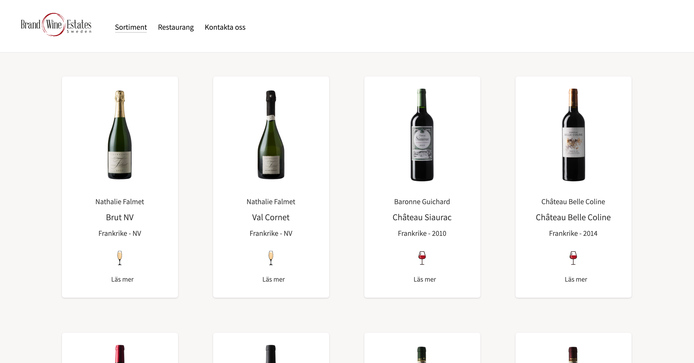

# Brand Wine Estates

My first website developed for a customer & integrated with Prismic CMS.

This project is available online at [brandwineeestates.com](https://www.brandwineestates.com/)

## About the company

Brand Wine Estates work with producers from the classic wine countries and regions of Europe. Their producers are very dedicated, and combine knowledge and passion within the production of wine, to the norwegian and swedish market. I got the opportunity to build their new website.

## Built with

- [GatsbyJS](https://www.gatsbyjs.org/) - React Framework
- [Styled Components](https://styled-components.com/) - Visual primitives for the component age
- [Prismic](https://prismic.io/) - Headless CMS
- [Tailwind](https://tailwindcss.com/) - Tailwind CSS is a highly customizable, low-level CSS framework

## Author

- **Martin Lindén** - _Designer & Developer_ - [martin-linden](https://github.com/martin-linden)

## Images - Desktop

  
  
  

## Images - Mobile

  

